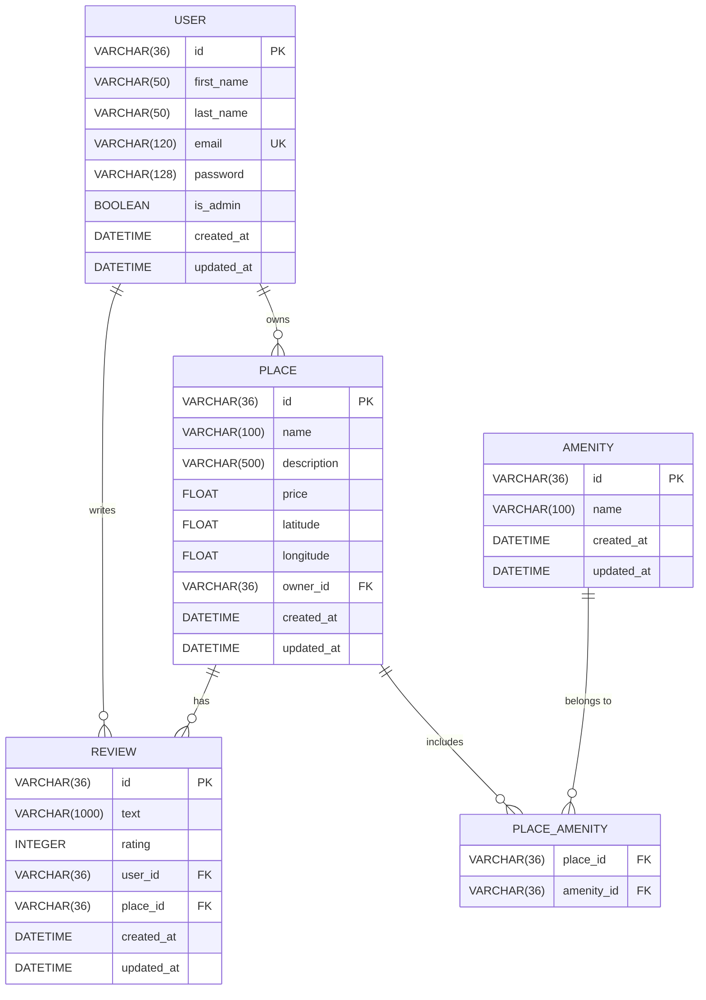

# HBnB Entity-Relationship Diagram

```mermaid
erDiagram
    USER {
        VARCHAR(36) id PK
        VARCHAR(50) first_name
        VARCHAR(50) last_name
        VARCHAR(120) email UK
        VARCHAR(128) password
        BOOLEAN is_admin
        DATETIME created_at
        DATETIME updated_at
    }

    PLACE {
        VARCHAR(36) id PK
        VARCHAR(100) name
        VARCHAR(500) description
        FLOAT price
        FLOAT latitude
        FLOAT longitude
        VARCHAR(36) owner_id FK
        DATETIME created_at
        DATETIME updated_at
    }

    REVIEW {
        VARCHAR(36) id PK
        VARCHAR(1000) text
        INTEGER rating
        VARCHAR(36) user_id FK
        VARCHAR(36) place_id FK
        DATETIME created_at
        DATETIME updated_at
    }

    AMENITY {
        VARCHAR(36) id PK
        VARCHAR(100) name
        DATETIME created_at
        DATETIME updated_at
    }

    PLACE_AMENITY {
        VARCHAR(36) place_id FK
        VARCHAR(36) amenity_id FK
    }

    USER ||--o{ PLACE : "owns"
    USER ||--o{ REVIEW : "writes"
    PLACE ||--o{ REVIEW : "has"
    PLACE ||--o{ PLACE_AMENITY : "includes"
    AMENITY ||--o{ PLACE_AMENITY : "belongs to"
```